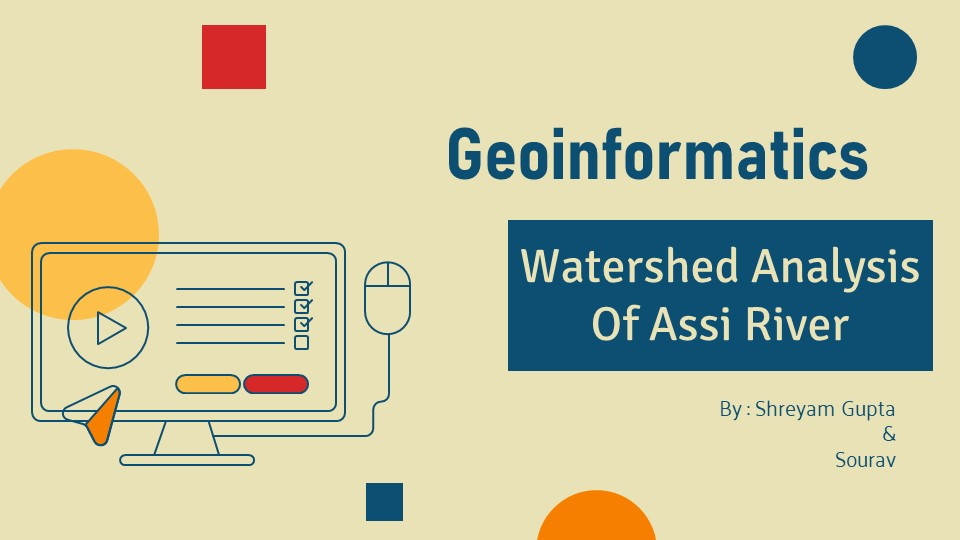
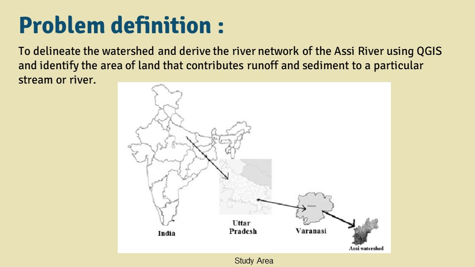
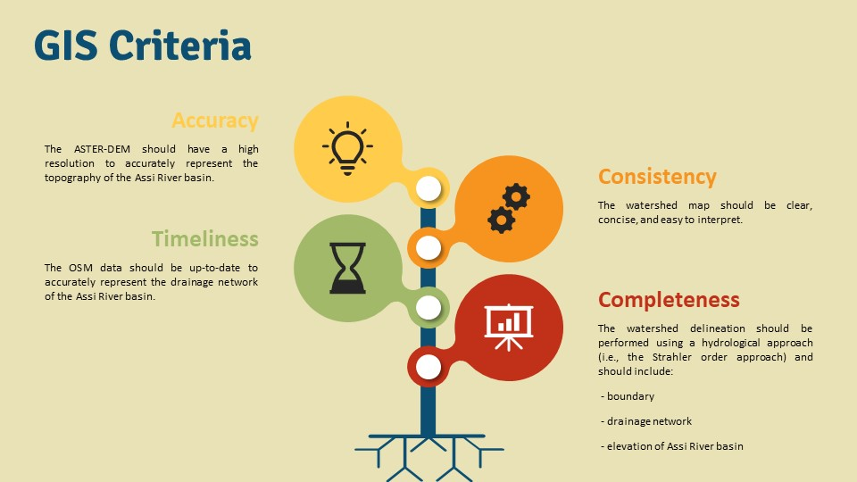
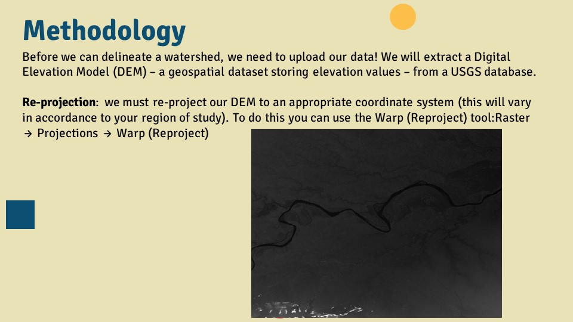
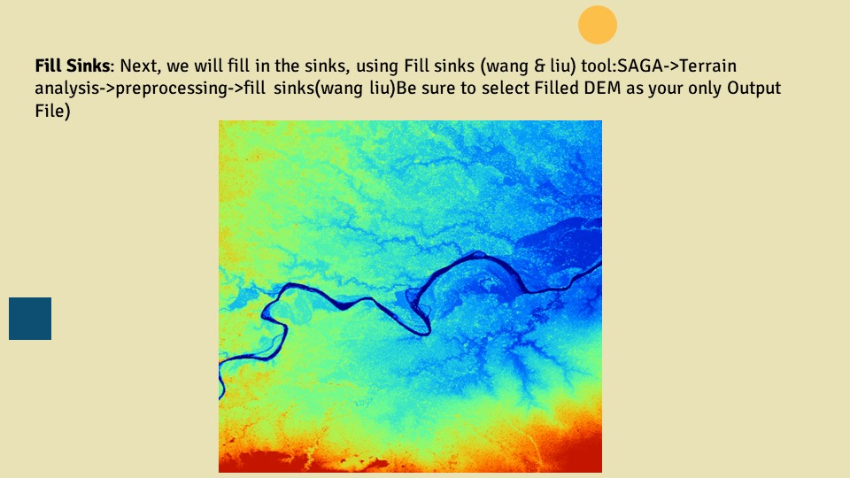
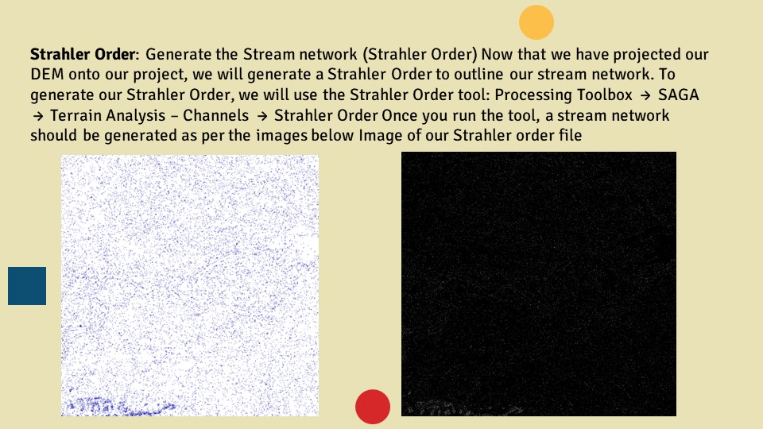
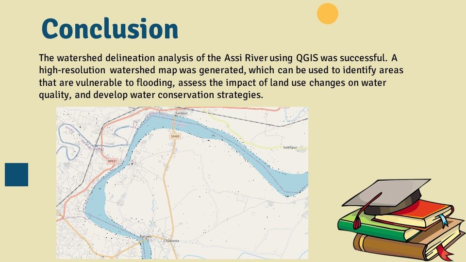

# QGIS-based Delineation
> Conducted watershed analysis for Assi River using **QGIS** to delineate the watershed and derive the river network.

## Technology Stack
* [QGIS](https://www.qgis.org/en/docs/index.html#328)  
* [SAGA-GIS](https://saga-gis.sourceforge.io/saga_tool_doc/2.3.0/index.html)  
* [USGS-EarthExplorer](https://earthexplorer.usgs.gov/) _(Digital Elevation Model)_
---

---

---

---

---

---

---

---

---

---
